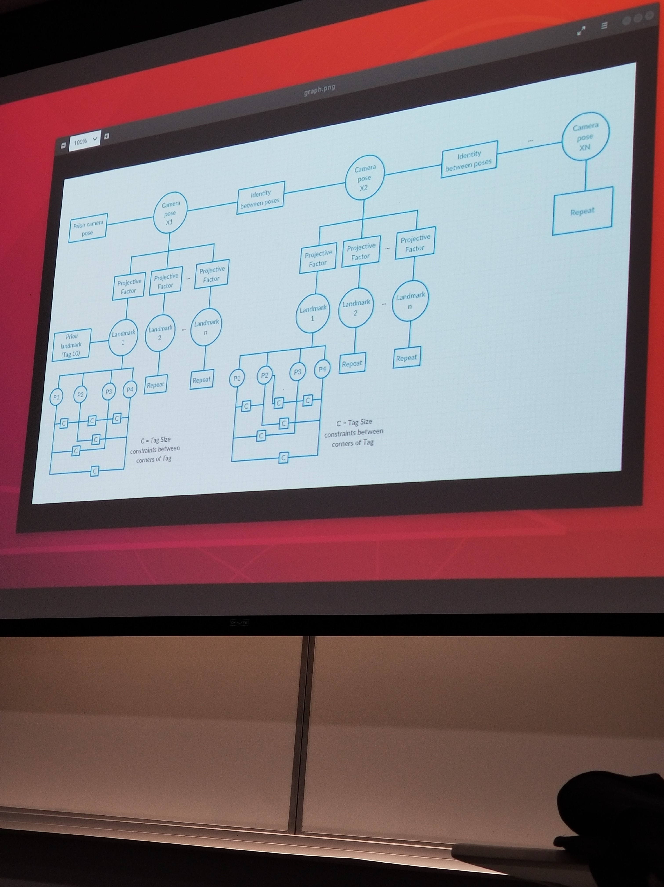

Sam Saltwick 

December 4th 2018 

Fall 2018 

# GTSAM Final Project
---

## General Overview
- DetAll contains information from the device
    - IMU data - don't need it
    - April Tags - Image Locations
    - Images are just for reference - april tag locations are needed
- Final output should be a plot of april tags with relative location of the device plotted

## GTSAM Overview
- Each time step become a section of the graph 
    - Camera pose 
    - n Projective Factors
    - n Landmarks- April tag corner points
    - Prior landmark (initially Tag 10)
    - Prior camera pose
- Factor graph details relationships - use it as a function

- Initialize odometry to 0 since the camera is slow

## Get 3D Landmark Locations
- Have: location of corners, size of the tag in the world, assume tags are on plane $Z=0$
- Can find world coordinates using a Homography 
    - H between tag in image and tag in world (More in project notes)
    - $\begin{bmatrix} u\\v\\w \end{bmatrix} = KH \begin{bmatrix} X\\Y\\Z\\W \end{bmatrix}$
    - $H = \begin{bmatrix}r_1 &r_2 & r_3&T\end{bmatrix}$
- **MATLAB Functions for Estimating Homography** - Should be a Piazza post about it, 3rd party
 - Know locaiton of origin tag in world
 - Homography between image tag and world tag origin
 - Moves points from April Tag/Image plane to world system around chosen origin
 
 ## Process
 - Set 1st april tag to be origin of world
 - H between location in world and location in image
 - Calculate locations of all other tags in image relative to origin
 - Do this for every frame in the data set
    - If world origin tag (ID=10) is not visible, use any tag that was visible in previous frame
 - For each frame in data set, using all tag locations, use estimateCameraPose() to solve PnP problem
 - Set up factor graph based on these measurements - refine estimate further 